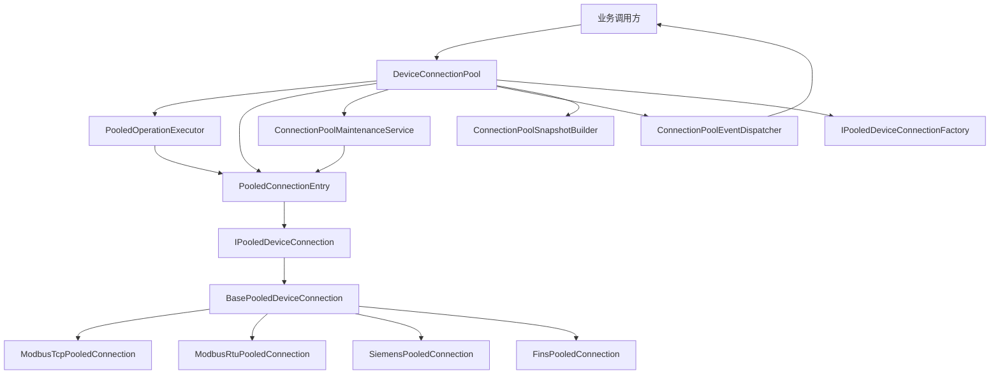
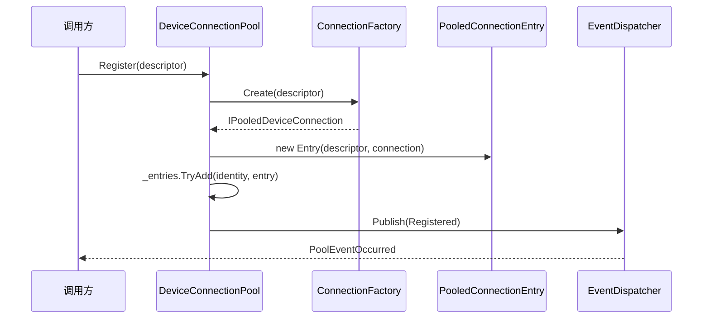
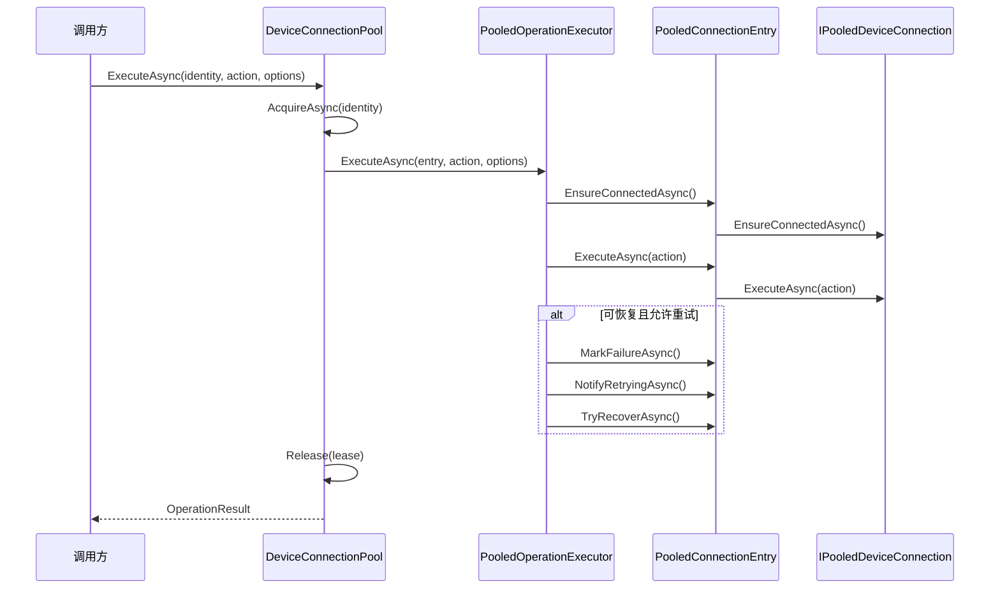
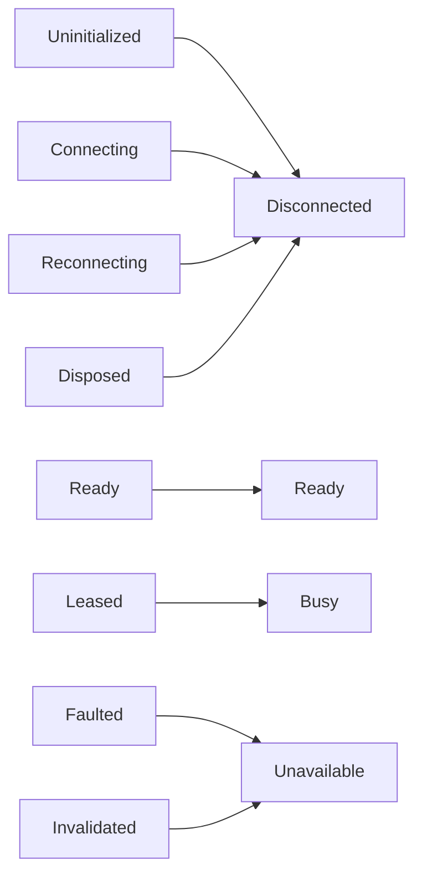

# ConnectionPool 类调用逻辑说明

本文档说明 `ConnectionPool` 各类之间的职责边界、核心调用路径和运行时交互关系，便于快速理解“谁在调用谁、为什么这样调用”。

## 1. 核心类分层

### 1.1 对外入口层
- `DeviceConnectionPool`：连接池总入口，负责注册、租约、执行、查询、维护调度与事件转发。
- `ISimpleDeviceConnectionPool`：默认简化入口（注册 + 执行 + 查询），屏蔽高级控制细节。
- `IDeviceConnectionPool*`：按职责拆分为 `Query / Execution / Control / Events`。

### 1.2 条目与执行层
- `PooledConnectionEntry`：单设备条目状态机，管理生命周期、租约、探活、恢复、失效、快照。
- `PooledOperationExecutor`：统一执行策略与恢复性重试（读默认可重试，写/诊断默认不可重试）。
- `PointListOperationHelper`：点位列表读写归一化、批量优化和回退。

### 1.3 协议包装层
- `IPooledDeviceConnection`：协议无关抽象，统一 `EnsureConnectedAsync / ExecuteAsync / ProbeAsync / Invalidate / Disconnect`。
- `BasePooledDeviceConnection`：通用实现（连接、探活超时、失效断链）。
- `ModbusTcpPooledConnection / ModbusRtuPooledConnection / SiemensPooledConnection / FinsPooledConnection`：协议探活覆盖实现。

### 1.4 维护与事件层
- `ConnectionPoolMaintenanceService`：后台维护循环（过期租约扫描、健康检查、空闲回收）。
- `ConnectionPoolEventDispatcher`：事件派发器，支持订阅者异常隔离。
- `ConnectionPoolSnapshotBuilder`：将条目快照聚合为池快照（四态统计）。

## 2. 类关系图（结构图）

## 3. 关键调用链

## 3.1 注册链路 `Register`
1. 调用方调用 `DeviceConnectionPool.Register(descriptor)`。
2. 池级校验：空值、重复注册、容量上限。
3. 通过 `IPooledDeviceConnectionFactory.Create()` 创建协议包装连接。
4. 创建 `PooledConnectionEntry` 并加入 `_entries`。
5. 发布 `Registered` 事件。

## 3.2 执行链路 `ExecuteAsync`
1. `DeviceConnectionPool.ExecuteAsync()` 根据 `identity` 取出条目。
2. 先 `AcquireAsync()` 获取租约（条目状态进入 `Busy` 映射）。
3. 调用 `PooledOperationExecutor.ExecuteAsync()`：
   - 先 `entry.EnsureConnectedAsync()`。
   - 调 `entry.ExecuteAsync(action)` 执行业务委托。
   - 失败时按 `ConnectionExecutionOptions` 判断是否恢复性重试。
   - 可恢复失败会触发 `MarkFailure -> NotifyRetrying -> TryRecover`。
4. `finally` 中 `Release()` 归还租约。

## 3.3 点位列表链路 `ReadPointsAsync / WritePointsAsync`
1. `DeviceConnectionPool` 先调用 `PointListOperationHelper.Normalize*Requests`。
2. 再复用 `ExecuteAsync` 主链路执行。
3. Helper 内部优先尝试批量（满足条件时），失败自动回退逐点执行。

## 3.4 后台维护链路
`ConnectionPoolMaintenanceService.RunAsync()` 周期执行三类动作：
1. 扫描并清理过期租约 `ExpireLeasesAsync`。
2. 健康检查 `RunHealthCheckAsync`（优先 `ProbeAsync`）。
3. 空闲回收 `CleanupIdle`。
4. 发布 `BackgroundMaintenanceCompleted`。

维护并发由 `MaxConcurrentMaintenanceOperations` 限制，故障恢复受 `FaultedReconnectCooldown` 控制。

## 4. 状态模型与映射

### 4.1 对外公开状态（四态）
- `Disconnected`
- `Ready`
- `Busy`
- `Unavailable`

### 4.2 内部生命周期状态
- `Uninitialized / Connecting / Ready / Leased / Reconnecting / Faulted / Invalidated / Disposed`

### 4.3 映射规则

## 5. 事件发布逻辑
- `PooledConnectionEntry` 在条目锁内只“收集事件通知动作”，在锁外统一 `PublishNotifications()`。
- `ConnectionPoolEventDispatcher` 支持逐订阅者调用；启用 `IsolateEventSubscriberExceptions` 时，单个订阅者异常不会影响主流程和其他订阅者。
- 事件分为：
  - `PoolEventOccurred`
  - `ConnectionStateChanged`
  - `LeaseChanged`
  - `MaintenanceCompleted`

## 6. 并发与安全边界
- 池级：`DeviceConnectionPool` 用 `_poolLock` 保护条目集合变更。
- 条目级：`PooledConnectionEntry` 用 `_entryLock` 串行化单设备状态机。
- 协议包装级：`BasePooledDeviceConnection` 用 `_sync` 保护底层客户端连接与探活。
- 失效语义：`Invalidate` 会触发最佳努力断链，避免继续复用底层连接。

## 7. 阅读源码建议顺序
1. `Core/DeviceConnectionPool.cs`
2. `Core/PooledConnectionEntry.cs`
3. `Core/PooledOperationExecutor.cs`
4. `Core/ConnectionPoolMaintenanceService.cs`
5. `Core/ConnectionPoolEventDispatcher.cs`
6. `Wrappers/BasePooledDeviceConnection.cs` + 各协议包装类

